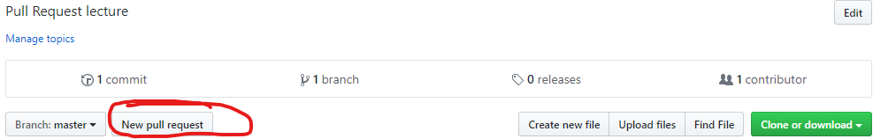

# learn-git-lecture
### Pull Request lecture

### The task to be done:

1. Clone this repo with `git clone https://github.com/Sinu5oid/learn-git-lecture.git`
1. Create a branch with `git checkout -b <your-nickname>` or `git branch <your-nickname>; git checkout <your-nickname>`
1. Make sure you are on the issue-branch with `git status`
1. Make changes in your issue-branch (do a function that receives some argument and returns a result in dedicated file e.g. `sinu5oid.py` and integrate its usage to `main.py`)
1. Commit them with `git commit -am "<message>"`
1. Push your changes to remote issue-branch with `git push --set-upstream origin <your-nickname>`
1. Go to GitHub repo
1. Click `New pull request` here

    
1. Use this template to fill pull request (you can also find it in `./github/PULL_REQUEST_TEMPLATE.md`):

    ```
    ### Context
    Link to the issue: 

    ### What has been done
    -

    ### Test plan
    -

    ### Todo/notes
    -
    ```
1. Create a pull request
1. You can review other's PRs and add comments
1. Wait for an approval

---
## Useful docs:

1. [Git user manual [EN]](https://mirrors.edge.kernel.org/pub/software/scm/git/docs/user-manual.html)
1. [Руководство по Git [RU]](https://git-scm.com/book/ru/v1/Введение-Основы-Git)
1. [How to create pull request [EN]](https://help.github.com/en/desktop/contributing-to-projects/creating-a-pull-request)
1. [About PR reviews [EN]](https://help.github.com/en/articles/about-pull-request-reviews)